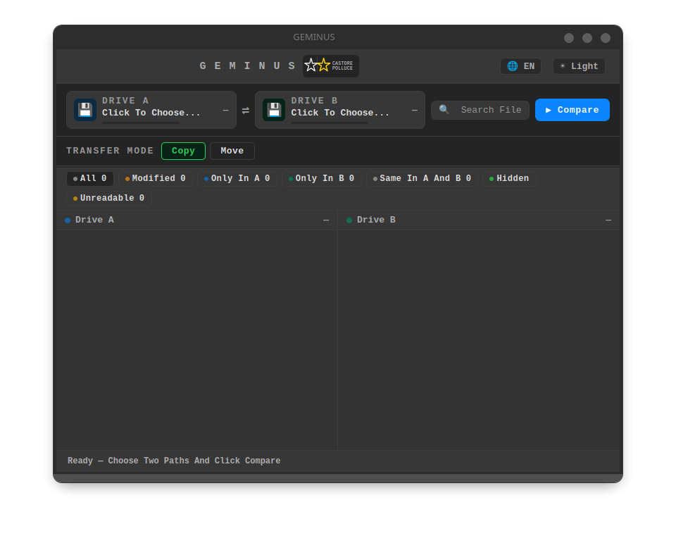
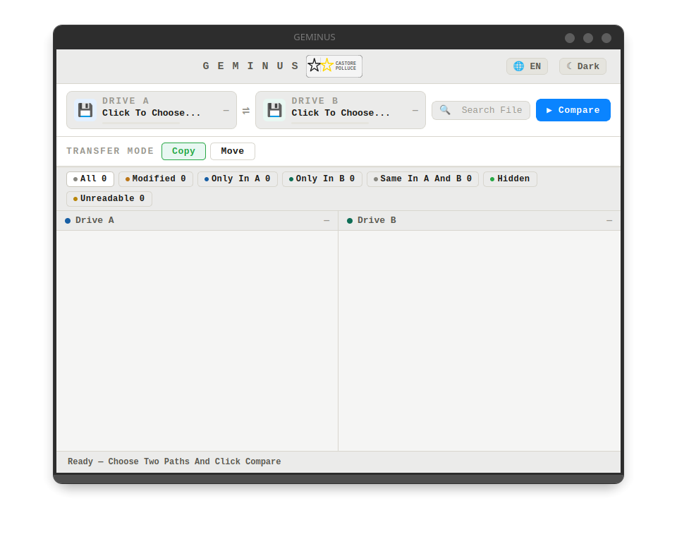

<!--
  This file is part of GEMINUS.

  Copyright (C) 2026 lucix.dev <lucix.dev@proton.me>

  GEMINUS is free software: you can redistribute it and/or modify it under
  the terms of the GNU General Public License as published by the Free
  Software Foundation, either version 3 of the License, or (at your option)
  any later version.

  GEMINUS is distributed in the hope that it will be useful, but WITHOUT ANY
  WARRANTY; without even the implied warranty of MERCHANTABILITY or FITNESS
  FOR A PARTICULAR PURPOSE. See the GNU General Public License for more
  details.

  You should have received a copy of the GNU General Public License along
  with GEMINUS. If not, see <https://www.gnu.org/licenses/>.

  SPDX-License-Identifier: GPL-3.0-or-later
-->
# GEMINUS

Compare two disks or folders on Linux and Windows — find differences, copy, move, and delete files.

---

## GEMINUS — Castore e Polluce

A NAS costs money, and it has to be kept running. Two external drives cost far less and ask for nothing. GEMINUS was born from this simple idea: one working drive and one backup drive, brought in line when you decide, with no dedicated hardware and no system to administer. GEMINUS is not a NAS — it is a tool for those who want to know exactly what has changed between two drives or folders, and act accordingly.

Choose two paths. GEMINUS compares them file by file. You see the differences. You copy, move, or delete what you want.

When you start a comparison, GEMINUS asks how you want to do it. Three methods, three levels of thoroughness:

- **Quick** looks at file names, sizes and dates. Fast, but doesn't tell you if the contents differ.
- **Deep** also reads the contents, to be sure files that look identical really are. Slow, but reliable.
- **Full** is Deep plus a physical health check on the drives. It asks for permission: on Linux the administrator password, on Windows your consent in the system's own window.

You pick the method that fits the moment. Everyday sync? Quick. Important backup? Deep. Doubts about an old USB drive? Full.

When it encounters an unreadable file on a damaged drive, GEMINUS does not stop — it marks it with a warning and completes the comparison. You know exactly what could not be read.

GEMINUS is an open source project born from a personal need. Anyone can contribute — with the same practical spirit with which it was built.

---

## Installation

**On Linux** — three formats, take the one you need: **AppImage** (a single file: make it executable and run it, nothing to install), a **`.deb`** package for Debian and derivatives, an **`.rpm`** package for Fedora.

**On Windows** — an installer: open it, click through to the end, and GEMINUS lands in the start menu. It needs Windows 10 22H2 or later, 64 bit. If the machine is missing the system component used to draw the interface, the installation adds it.

The installer is not signed, so Windows shows a security warning before opening it: that is expected, and you get past it by choosing to proceed. A certificate costs money every year, and this is one person's project.

---

## Manual

Everything GEMINUS does, step by step, in English and Italian: [`MANUAL.md`](MANUAL.md).

---

## Screenshots

---

## License

Copyright (C) 2026 lucix.dev <lucix.dev@proton.me>

GEMINUS is free software under the [GNU GPL, version 3 or later](https://www.gnu.org/licenses/gpl-3.0.html)
— see `LICENSE`. On Windows the interface is rendered by the Microsoft Edge
WebView2 runtime, which is not free software: `LICENSE-EXCEPTION.txt` grants the
additional permission that allows linking against it. Software written by others
and shipped together with GEMINUS is listed in `THIRD-PARTY-NOTICES.txt`.

---
---

# GEMINUS

Confronta due dischi o cartelle su Linux e Windows — trova le differenze, copia, sposta ed elimina file.

---

## GEMINUS — Castore e Polluce

Un NAS costa, e va tenuto in piedi. Due dischi esterni costano molto meno e non chiedono niente. GEMINUS nasce da questa idea semplice: un disco di lavoro e un disco di backup, allineati quando lo decidi tu, senza hardware dedicato e senza un sistema da amministrare. GEMINUS non è un NAS — è uno strumento per chi vuole sapere esattamente cosa è cambiato tra due dischi o cartelle, e agire di conseguenza.

Scegli due percorsi. GEMINUS li confronta file per file. Vedi le differenze. Copi, sposti o cancelli quello che vuoi.

Quando lanci un confronto, GEMINUS ti chiede come vuoi farlo. Tre metodi, tre livelli di accuratezza:

- **Veloce** guarda nomi, dimensioni e date. Rapido, ma non ti dice se il contenuto è diverso.
- **Approfondito** legge anche il contenuto, per essere sicuro che i file che sembrano uguali lo siano davvero. Lento, ma affidabile.
- **Completo** è Approfondito più una verifica fisica della salute dei dischi. Chiede un permesso: su Linux la password di amministratore, su Windows il consenso nella finestra del sistema.

Scegli il metodo che fa al caso tuo. Sincronizzazione quotidiana? Veloce. Backup importante? Approfondito. Dubbi su una USB vecchia? Completo.

Quando incontra un file illeggibile su un disco danneggiato, GEMINUS non si blocca — lo marca con un avviso e porta a termine il confronto. Sai esattamente cosa non è stato possibile leggere.

GEMINUS è un progetto open source nato da un'esigenza personale. Chiunque può contribuire — con lo stesso spirito pratico con cui è stato costruito.

---

## Installazione

**Su Linux** — tre formati, scegli quello che ti serve: **AppImage** (un file solo: lo rendi eseguibile e lo lanci, senza installare niente), pacchetto **`.deb`** per Debian e derivate, pacchetto **`.rpm`** per Fedora.

**Su Windows** — un programma di installazione: lo apri, vai avanti fino alla fine, e GEMINUS finisce nel menu di avvio. Serve Windows 10 22H2 o successivo, a 64 bit. Se al computer manca il componente di sistema che serve a mostrare l'interfaccia, l'installazione lo aggiunge da sé.

Il programma di installazione non è firmato, quindi Windows mostra un avviso di sicurezza prima di aprirlo: è atteso, e si passa oltre scegliendo di procedere. Un certificato costa ogni anno, e questo è il progetto di una persona sola.

---

## Manuale

Tutto quello che GEMINUS fa, passo per passo, in italiano e in inglese: [`MANUAL.md`](MANUAL.md).

---

## Screenshot

---

## Licenza

Copyright (C) 2026 lucix.dev <lucix.dev@proton.me>

GEMINUS è software libero sotto [GNU GPL, versione 3 o successive](https://www.gnu.org/licenses/gpl-3.0.html)
— vedi `LICENSE`. Su Windows l'interfaccia è disegnata dal motore Microsoft Edge
WebView2, che non è software libero: `LICENSE-EXCEPTION.txt` concede il permesso
aggiuntivo che ne autorizza il collegamento. Il software scritto da altri e
distribuito insieme a GEMINUS è elencato in `THIRD-PARTY-NOTICES.txt`.
